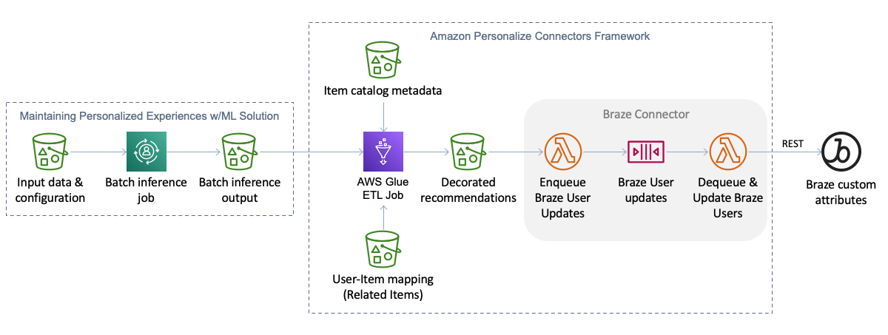

# Amazon Personalize Connectors

This project provides a connector framework that provides a general purpose ETL pipeline for consuming output from Amazon Personalize batch inference jobs, decorating recommended itemId's from Personalize with rich item metadata needed to render them in customer-facing tools/applications, and sending the decorated output to a supported downstream destination. Currently the only supported destination is the [Braze](https://www.braze.com/) customer engagement platform. Additional destinations can be easily plugged into this framework.



## Batch Inference

This solution builds upon the automation of batch inference jobs provided in the [Maintaining Personalized Experiences with Machine Learning](https://aws.amazon.com/solutions/implementations/maintaining-personalized-experiences-with-ml/) solution. That is, you must deploy that solution before deploying this solution and the ouput of batch inference jobs from that solution is used as input for this solution.

The [Maintaining Personalized Experiences with Machine Learning](https://aws.amazon.com/solutions/implementations/maintaining-personalized-experiences-with-ml/) solution maintains its own S3 bucket where batch inference job input and output files are stored. The S3 bucket layout looks something like this (please consult the solution documentation for more details).

```
batch/
│
└── <personalize_dataset_group_name>/
    └── <personalize_solution_name>/
        └── job_config.json
        └── <personalize_solution_name_YYYY_MM_DD_HH_MM_SS>/
            ├── _CHECK
            └── job_config.json.out
```

This solution is designed to take in the output files from batch inference jobs that are processed by the above solution. This solution has its own S3 bucket for job inputs and outputs. Here is the layout of the S3 bucket.

```
etl_jobs/
│
└── related_items/
    └── <job_name>/
        └── config.json
        └── input/
            └── user_item_mapping/
                └── <user_item_mapping_part_1>.csv
                └── <user_item_mapping_part_2>.csv
                └── <user_item_mapping_part_n>.csv
            └── item_metadata/ (optional)
                └── <item_metadata_part_1>.json
                └── <item_metadata_part_2>.json
                └── <item_metadata_part_n>.json
        └── output/
            └── <connector_type_1>/
                └── state/
                └── year=<YYYY>/
                    └── month=<MM>/
                        └── day=<DD>/
                            └── time=<HHMMSS>/
            └── <connector_type_2>/
                └── state/
                └── year=<YYYY>/
                    └── month=<MM>/
                        └── day=<DD>/
                            └── time=<HHMMSS>/
            └── <connector_type_n>/
                └── state/
                └── year=<YYYY>/
                    └── month=<MM>/
                        └── day=<DD>/
                            └── time=<HHMMSS>/
│
└── user_personalization/
    └── <job_name>/
        └── config.json
        └── input/
            └── item_metadata/ (optional)
                └── <item_metadata_part_1>.json
                └── <item_metadata_part_2>.json
                └── <item_metadata_part_n>.json
        └── output/
            └── <connector_type_1>/
                └── state/
                └── year=<YYYY>/
                    └── month=<MM>/
                        └── day=<DD>/
                            └── time=<HHMMSS>/
            └── <connector_type_2>/
                └── state/
                └── year=<YYYY>/
                    └── month=<MM>/
                        └── day=<DD>/
                            └── time=<HHMMSS>/
            └── <connector_type_n>/
                └── state/
                └── year=<YYYY>/
                    └── month=<MM>/
                        └── day=<DD>/
                            └── time=<HHMMSS>/
```

There are currently two batch inference job types supported by this solution: related items and user_personalization. Personalized ranking and user segmentation job types may be added in the future.

To create a connector pipeline job flow, follow these steps.

1. **Create a pipeline configuration file** and upload it to the connector bucket created in your account by this solution when it is deployed (see `ConnectorBucket` CloudFormation output template parameter). The pipeline configuration file must be named `config.json` and it must be placed under the `etl_jobs/<job_type>/<job_name>/` where `<job_type>` is either "related_items" or "user_personalization" and `<job_name>` is defined by you.
    - The `config.json` file must have "batchInferencePath" specified and at least one connector declared under "connectors". See the [sample](./sample/config.json) for an example.
    - The "batchInferencePath" field value must be the S3 path to a batch inference job output location in the Maintaining Personalized Experiences with Machine Learning solution.
2. If you want the ETL pipeline to decorate the recommended items with item metadata of your choice, **upload your item metadata file(s)** to the `etl_jobs/<job_type>/<job_name>/input/item_metadata/` folder corresponding to the `<job_type>` and `<job_name>` defined in the prior step.
3. If the `<job_type>` is "related_items", you must **provide user-item mapping file(s)** so that the ETL pipeline can attribute related item recommendations back to a specific user. The user-item mappings file(s) should be in CSV format with USER_ID and ITEM_ID columns.
4. From the [AWS Glue console](https://console.aws.amazon.com/glue/home) in the AWS account and region where you deployed this solution or via the AWS CLI or SDK, configure the appropriate Personalize Connector ETL job.
    - On the "Job details", expand "Advanced properties" and find the "Job parameters" panel. Add a job parameter named `--S3_JOB_PATH` and for the parameter value enter the S3 path to the job folder created in the first step above (i.e., `s3://[BUCKET_NAME]/etl_jobs/<job_type>/<job_name>/`).
    - **Run the job**.

## Braze Connector

The Braze Connector automatically detects when the ETL pipeline generates output in a `braze` connector type directory and then [loads](./src/braze_enqueue_function/) the contents of those file(s) into an SQS queue. An AWS Lambda [function](./src/braze_dequeue_function/) consumes the messages in the SQS queue and generates REST API calls to the [User track](https://www.braze.com/docs/api/endpoints/user_data/post_user_track/) API. This decoupled approach allows the ETL and Braze API steps to run at their own pace.

### Configuration

When you deploy this solution in your AWS account (described below), you will be prompted for two pieces of information required to use the Braze connector.

- Braze API Key: create a Braze REST API Key in the Braze dashboard under the "Developer Console" (under "Settings" at the bottom of the left navigation). The API Key must have the `users.track` permission enabled.
- Braze REST Endpoint: the Braze REST Endpoint to call to synchronize user attributes. See the [Endpoints](https://www.braze.com/docs/api/basics#endpoints) documentation for instructions on how to determine the endpoint to use for your instance.

These configuration values will be stored in the [AWS Systems Manager Parameter Store](https://docs.aws.amazon.com/systems-manager/latest/userguide/systems-manager-parameter-store.html) and retrieved by the Lambda function that calls the Braze API.

_The Braze Connector infrastructure components will only be deployed if both the Braze API Key and Braze REST Endpoint CloudFormation parameters are provided._

### Input

- **Create a pipeline configuration file** and upload it to the appropriate location in the solution S3 bucket as described above, making to sure to create a "braze" connector. Here is an example that declares the item metadata fields to synchronize to each Braze user profile (optional, all fields used by default), an attribute prefix (optional), and other attributes to set for each user.
```javascript
{
    "batchInferencePath": "s3://[PERSONALIZE_MLOPS_BUCKET/batch/[DATASET_GROUP_NAME/[SOLUTION_NAME/[SOLUTION_NAME]-YYYY-MM-DD-HH-MM-SS/",
    "performDeltaCheck": true,
    "saveBatchInferenceErrors": true,
    "connectors": {
        "braze": {
            "itemMetadataFields": ["name","description","price","image","category","style"],
            "attributePrefix": "recs_",
            "otherAttributes": {
                "other_attrib1": "custom_value"
            }
        }
    }
}
```
- **User/Item mapping:** this file is required for related item batch inference jobs and provides a mapping of user IDs to item IDs. This file is used to reverse map the `itemId` from the batch inference output job back to user ID(s) to synchronize to your Braze environment.
- **Item metadata:** metadata for items to include as additional user attributes.

## Processing

1. Load batch inference job output file
    - Split errors from the batch inference job output. If `saveBatchInferenceErrors` is set to `true` in the pipeline configuration file, write errors to `etl_jobs/<job_type>/<job_name>/errors/` for analysis. Otherwise, errors are discarded.
2. Load user-item mapping files (required for related items job type).
3. Join batch inference job file with user-item mapping dataset (joining on item ID)
4. If item metadata is present in the job input folder, load item metadata and join it to the batch inference results. This is where each `itemId` is decorated with item metadata.
5. For each connector configured in the pipeline configuration file:
    1. If there is state data from the last time the ETL pipeline was run for the job, load the last sync state data and subtract it from the pending updates from the batch inference job. This essentially removes all redundant user updates in the ETL job dataset. This reduces the amount user updates that are synchronized to the connector destination.
    2. Write the final dataset to the `etl_jobs/<job_type>/<job_name>/output/` folder.
    3. Update the last sync state data with the update recommendations (TODO).

At this the connectors will detect the newly written ETL job output files and synchronize the updates to the connector destination.
## File formats and examples

### Related Items

Amazon Personalize batch inference job input files look something like this:

```javascript
{"itemId": "105"}
{"itemId": "106"}
{"itemId": "441"}
```

The files are in JSON Lines format.

When a batch inference job completes, the output format looks something like this:

```javascript
{"input": {"itemId": "105"}, "output": {"recommendedItems": ["106", "107", "49"]}}
{"input": {"itemId": "106"}, "output": {"recommendedItems": ["105", "107", "49"]}}
{"input": {"itemId": "441"}, "output": {"recommendedItems": ["2", "442", "435"]}}
```

The output format is also in JSON Lines format where each line from the input file is represented in the `input` element and recommended related items are represented in an array under the `output` element.

So far the above files describe how Amazon Personalize batch inference input and output files look. The following files are used are used in this solution as part of the ETL pipeline (along with the output from a batch inference job).

First, for related items recommendations, we need a mapping file that can be used to map item IDs from the `input`'s above to users who should receive those related item recommendations. The user-item mapping file(s) are a simple CSV format with a USER_ID and ITEM_ID. You can include all user-item mappings in a single CSV or break them up into multiple CSVs. The ETL pipeline will automatically read in all CSVs in the `etl_jobs/<job_type>/<job_name>/input/user_item_mapping/` folder (see steps above for details).

```csv
USER_ID,ITEM_ID
123,105
124,105
234,106
235,441
```

You can optionally provide item metadata file(s) in the `etl_jobs/<job_type>/<job_name>/input/item_metadata/` folder that provide the metadata needed in downstream destinations to render recommendations. These files must be in JSON Lines format where each line is a JSON document containing metadata for an item.

```javascript
{"id": "6579c22f-be2b-444c-a52b-0116dd82df6c", "current_stock": 15, "name": "Tan Backpack", "category": "accessories", "style": "backpack", "description": "This tan backpack is nifty for traveling", "price": 90.99, "image": "6579c22f-be2b-444c-a52b-0116dd82df6c.jpg", "gender_affinity": "F", "where_visible": "UI", "image_url": "https://d22kv7nk938ern.cloudfront.net/images/accessories/6579c22f-be2b-444c-a52b-0116dd82df6c.jpg"}
{"id": "2e852905-c6f4-47db-802c-654013571922", "current_stock": 15, "name": "Pale Pink Backpack", "category": "accessories", "style": "backpack", "description": "Pale pink backpack for women", "price": 123.99, "image": "2e852905-c6f4-47db-802c-654013571922.jpg", "gender_affinity": "F", "where_visible": "UI", "image_url": "https://d22kv7nk938ern.cloudfront.net/images/accessories/2e852905-c6f4-47db-802c-654013571922.jpg"}
{"id": "4ec7ff5c-f70f-4984-b6c4-c7ef37cc0c09", "current_stock": 17, "name": "Gainsboro Backpack", "category": "accessories", "style": "backpack", "description": "This gainsboro backpack for women is first-rate for the season", "price": 87.99, "image": "4ec7ff5c-f70f-4984-b6c4-c7ef37cc0c09.jpg", "gender_affinity": "F", "where_visible": "UI", "image_url": "https://d22kv7nk938ern.cloudfront.net/images/accessories/4ec7ff5c-f70f-4984-b6c4-c7ef37cc0c09.jpg"}
```

## Installing and configuring the solution

***IMPORTANT NOTE:** Deploying this solution in your AWS account will create and consume AWS resources, which will cost money. Therefore, if after installing this solution you choose not to use it as part of your Personalize deployment, be sure to follow the Uninstall instructions below to avoid ongoing charges and to clean up all data.*

**You must have the [Maintaining Personalized Experiences with Machine Learning](https://aws.amazon.com/solutions/implementations/maintaining-personalized-experiences-with-ml/) solution installed before you can complete the steps below.**

There are two options for installing this solution. The easiest and most convenient installation option is using CloudFormation directly. If your Amazon Personalize workload is deployed in one of the AWS regions listed in Option 1 below, click the "Launch Stack" button for the appropriate region. Otherwise, to install the solution in another AWS region, use Option 2.

### Option 1: Install using CloudFormation (single-click, easiest)

To support easy single-click deployments, this solution has been packaged and staged in the following regions. If your Amazon Personalize resources are deployed in one of these regions, it is recommended to use the appropriate "Launch Stack" button below. If your Personalize resources are in a different region, use Option 2.

Region name | Region code | Launch
--- | --- | ---
US East (N. Virginia) | us-east-1 | [](https://console.aws.amazon.com/cloudformation/home?region=us-east-1#/stacks/create/review?templateURL=https://s3.amazonaws.com/personalize-solution-staging-us-east-1/personalize-connectors/template.yaml&stackName=personalize-connectors)
US East (Ohio) | us-east-2 | [](https://console.aws.amazon.com/cloudformation/home?region=us-east-2#/stacks/create/review?templateURL=https://s3-us-east-2.amazonaws.com/personalize-solution-staging-us-east-2/personalize-connectors/template.yaml&stackName=personalize-connectors)
US West (Oregon) | us-west-2 | [](https://console.aws.amazon.com/cloudformation/home?region=us-west-2#/stacks/create/review?templateURL=https://s3-us-west-2.amazonaws.com/personalize-solution-staging-us-west-2/personalize-connectors/template.yaml&stackName=personalize-connectors)
Europe (Ireland) | eu-west-1 | [](https://console.aws.amazon.com/cloudformation/home?region=eu-west-1#/stacks/create/review?templateURL=https://s3-eu-west-1.amazonaws.com/personalize-solution-staging-eu-west-1/personalize-connectors/template.yaml&stackName=personalize-connectors)
Asia Pacific (Sydney) | ap-southeast-2 | [](https://console.aws.amazon.com/cloudformation/home?region=ap-southeast-2#/stacks/create/review?templateURL=https://s3-ap-southeast-2.amazonaws.com/personalize-solution-staging-ap-southeast-2/personalize-connectors/template.yaml&stackName=personalize-connectors)

### Option 2: Install using Serverless Application Model (manual installation)

To manually install this solution or to install this solution into a region not listed under Option 1 above, perform the following steps to install using the AWS [Serverless Application Model](https://aws.amazon.com/serverless/sam/) (SAM) tool.

#### Clone the solution respository

```bash
git clone git@github.com:aws-samples/amazon-personalize-connectors.git
```

#### Install the solution using SAM

To use the SAM CLI, you need the following tools locally installed.

* SAM CLI - [Install the SAM CLI](https://docs.aws.amazon.com/serverless-application-model/latest/developerguide/serverless-sam-cli-install.html)
* [Python 3 installed](https://www.python.org/downloads/)
* Docker - [Install Docker community edition](https://hub.docker.com/search/?type=edition&offering=community)

Then ensure you are logged in to `public.ecr.aws` in Docker so SAM can download the Docker build images, by running the following command.

```bash
aws ecr-public get-login-password --region us-east-1 | docker login --username AWS --password-stdin public.ecr.aws
```

To build and deploy the application for the first time, run the following in your shell:

```bash
cd amazon-personalize-connectors
sam build --use-container --cached
sam deploy --guided
```

The `sam build --use-container --cached` command will build and package the source of the solution. The `sam deploy --guided` command will prompt you for deployment configuration information and ultimately deploy the solution to your AWS account. **Be sure to deploy the solution in the same AWS region where your Amazon Personalize workload and the [Maintaining Personalized Experiences with Machine Learning](https://aws.amazon.com/solutions/implementations/maintaining-personalized-experiences-with-ml/) solution is installed.

### Deployment template parameters

When installing using either option above, you are presented with a few deployment parameters. These parameters control how the solution is configured to match your desired environment configuration.

|Parameter name	|Type	|Valid values	|Default	|Description	|
|---	|---	|---	|---	|---	|
|EnvironmentName | String | Alphanumeric | 'prod' | Application environment name (such as "dev", "staging", "prod", etc). Used to organize parameters in SSM. |
|MaintainingPersonalizeStackName | String | Alphanumeric | | Name of an active CloudFormation stack that contains the resources for the [Maintaining Personalized Experiences with Machine Learning](https://aws.amazon.com/solutions/implementations/maintaining-personalized-experiences-with-ml/) solution. This solution must already be deployed in the same account and region. The S3 bucket where Personalize batch inference job output files are written are needed by this solution. |
|BrazeRestEndpointUrl | String | URL |  | Braze REST Endpoint to use when synchronizing recommendation details for users. See the [Braze API documentation](https://www.braze.com/docs/api/basics/#endpoints) to map your Braze instance or dashboard URL to the appropriate REST Endpoint. The format should look like: https://rest.iad-01.braze.com |
|BrazeApiKey | String | Alphanumeric |  | Braze API Key to use when synchronizing recommendation details for users. An API Key can be created in the Braze dashboard/console. This key must have the "users.track" permission.|

## Uninstalling the solution

The easiest way to uninstall/delete the solution is using the CloudFormation page in the AWS console. Just find the CloudFormation stack name you used to install the solution and click "Delete". Alternatively, you can use AWS CLI to delete the CloudFormation stack. Assuming you used the default application name for the stack name (`personalize-connectors`), you can run the following command:

```bash
aws cloudformation delete-stack --stack-name personalize-connectors
```

If you used a stack name other than `personalize-connectors`, substitute your stack name in the command above.

## Reporting issues

If you encounter a bug, please create a new issue with as much detail as possible and steps for reproducing the bug. Similarly, if you have an idea for an improvement, please add an issue as well. Pull requests are also welcome! See the [Contributing Guidelines](./CONTRIBUTING.md) for more details.

## License summary

This sample code is made available under a MIT-0 license. See the LICENSE file.
